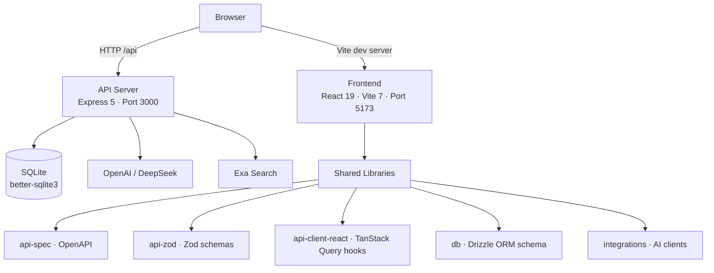

<div align="center">



[](https://github.com/himanshu-nakrani/Resume-AI-Matcher/stargazers)
[](./LICENSE)
[](https://himanshu-nakrani.github.io/Resume-AI-Matcher/)
[](https://www.typescriptlang.org/)
[](https://react.dev/)
[](https://vitejs.dev/)
[](https://expressjs.com/)
[](https://sqlite.org/)
[](https://pnpm.io/)

[🚀 Live Demo](https://himanshu-nakrani.github.io/Resume-AI-Matcher/) · [📖 API Reference](#api-reference) · [🐛 Report Bug](https://github.com/himanshu-nakrani/Resume-AI-Matcher/issues) · [✨ Request Feature](https://github.com/himanshu-nakrani/Resume-AI-Matcher/issues)

</div>

---

## 📋 Table of Contents

- [About](#about)
- [Features](#features)
- [Demo](#demo)
- [Architecture](#architecture)
- [Tech Stack](#tech-stack)
- [Getting Started](#getting-started)
  - [Prerequisites](#prerequisites)
  - [Installation](#installation)
  - [Environment Variables](#environment-variables)
  - [Running Locally](#running-locally)
- [Usage](#usage)
- [API Reference](#api-reference)
- [Testing](#testing)
- [Deployment](#deployment)
- [Project Structure](#project-structure)
- [Roadmap](#roadmap)
- [Contributing](#contributing)
- [License](#license)
- [Acknowledgments](#acknowledgments)

---

## 💡 About

OptiMatch is an intelligent, AI-powered platform that helps job seekers optimize their resumes, evaluate job fit, and manage their entire application pipeline in one place.

Paste your resume and a job description — or simply drop in a job URL — and OptiMatch generates:

- An **AI Fit Score** (0–100) with role-specific reasoning
- An **ATS Compatibility Score** with matched and missing keywords
- Personalized **strengths**, **gaps**, and **improvement suggestions**
- A tailored **cover letter** with multiple tone variations
- A **LinkedIn post** to announce your search
- **Interview questions**, **learning plans**, **salary guidance**, and **career-path suggestions**

Beyond analysis, OptiMatch acts as a full CRM for your job search: track statuses on a Kanban board, set deadlines and follow-ups, analyze pipeline metrics, and share public links with recruiters.

---

## ✨ Features

### Resume & Job Analysis
- 🤖 **AI Fit Scoring** — Understand how well your resume matches a role
- 🔍 **ATS Keyword Matching** — See which keywords you hit and miss
- 📝 **Cover Letter Generator** — Professional, friendly, enthusiastic, and concise tones
- 💼 **Job URL Import** — Auto-extract title, company, and description from a posting
- 💬 **LinkedIn Post Generator** — Ready-to-share network updates
- ❓ **Interview Questions** — AI-generated questions based on gaps and role
- 📚 **Learning Plan** — Curated courses, certifications, and projects
- 💰 **Salary Guide & Negotiation Simulator** — Market context and practice counters

### Application Tracking
- 📊 **Kanban Board** — Drag-and-drop pipeline: Not Applied → Applied → Interview → Offer → Rejected
- 📅 **Deadlines & Follow-ups** — Per-analysis reminders with in-app notifications
- 🏷️ **Tags, Contacts & Notes** — Organize every opportunity
- ⭐ **Favorites** — Star important analyses for quick access
- 🔄 **Duplicate Analysis** — Clone and adapt for similar roles
- 🔗 **Public Share Links** — Revocable tokens for easy sharing

### Analytics & Productivity
- 📈 **Score Trends & Keyword Trends** — Track improvement over time
- 🎯 **Pipeline Funnel** — Conversion rates across stages
- ⌨️ **Global Command Palette** — `⌘K` / `Ctrl+K` search and navigation
- 🌙 **Dark Mode** — Seamless light/dark switching
- 📄 **PDF Export** — Print-optimized analysis layout
- 📤 **Bulk CSV Export** — Export history for spreadsheet workflows

---

## 🎥 Demo

**Live Demo:** [https://himanshu-nakrani.github.io/Resume-AI-Matcher/](https://himanshu-nakrani.github.io/Resume-AI-Matcher/)

> 🖼️ *Screenshots and a recorded walkthrough will be added here soon.*

---

## 🏗️ Architecture

OptiMatch is a **pnpm workspace monorepo** with a clear separation between the React frontend, Express API, and shared libraries.



### Request Flow

1. The user submits a resume + job description in the frontend.
2. The frontend calls `POST /api/analyses` via a generated TanStack Query hook.
3. The Express server validates the request with Zod, persists metadata to SQLite, and calls the AI provider.
4. The AI response is parsed, scored, and returned to the frontend.
5. The user can track, compare, and share the analysis from the UI.

---

## 🛠️ Tech Stack

### Frontend
| Technology | Purpose |
|------------|---------|
| [React 19](https://react.dev/) | UI library |
| [Vite 7](https://vitejs.dev/) | Build tooling and dev server |
| [TypeScript 5.9](https://www.typescriptlang.org/) | Type safety |
| [TanStack Query](https://tanstack.com/query) | Server-state management |
| [Wouter](https://github.com/molefrog/wouter) | Lightweight routing |
| [shadcn/ui](https://ui.shadcn.com/) + [Tailwind CSS](https://tailwindcss.com/) | Accessible components and styling |
| [Radix UI](https://www.radix-ui.com/) | Headless UI primitives |
| [Recharts](https://recharts.org/) | Data visualization |
| [Framer Motion](https://www.framer.com/motion/) | Animations |
| [React Hook Form](https://react-hook-form.com/) + [Zod](https://zod.dev/) | Forms and validation |

### Backend
| Technology | Purpose |
|------------|---------|
| [Express 5](https://expressjs.com/) | HTTP API framework |
| [SQLite](https://sqlite.org/) + [better-sqlite3](https://github.com/WiseLibs/better-sqlite3) | Local database |
| [Drizzle ORM](https://orm.drizzle.team/) | Type-safe database access |
| [Zod](https://zod.dev/) | Runtime validation |
| [Pino](https://getpino.io/) | Structured logging |
| [esbuild](https://esbuild.github.io/) | Fast backend bundling |

### AI & Integrations
| Provider | Use Case |
|----------|----------|
| [OpenAI GPT](https://openai.com/) / [DeepSeek](https://www.deepseek.com/) | Resume analysis, generation, and coaching |
| [Exa](https://exa.ai/) | Job URL content extraction and search |

---

## 🚀 Getting Started

### Prerequisites

- [Node.js](https://nodejs.org/) 24+
- [pnpm](https://pnpm.io/) 9+
- API keys for at least one AI provider:
  - [DeepSeek API key](https://platform.deepseek.com/) **or**
  - [OpenAI API key](https://platform.openai.com/)
- [Exa API key](https://exa.ai/) (required for job URL import)

### Installation

```bash
# 1. Clone the repository
git clone https://github.com/himanshu-nakrani/Resume-AI-Matcher.git
cd Resume-AI-Matcher

# 2. Install dependencies
pnpm install

# 3. Set up the SQLite database
pnpm --filter @workspace/db run push

# 4. Generate API types and React Query hooks from OpenAPI
pnpm --filter @workspace/api-spec run codegen
```

### Environment Variables

Create `artifacts/api-server/.env`:

```env
# Required — choose at least one AI provider
DEEPSEEK_API_KEY=your_deepseek_key_here
# OPENAI_API_KEY=your_openai_key_here

# Required for job URL import
EXA_API_KEY=your_exa_key_here

# Optional
PORT=3000
NODE_ENV=development
```

> 🔒 **Security note:** `.env` files are gitignored. Never commit API keys.

### Running Locally

Start the API server:

```bash
pnpm --filter @workspace/api-server run dev
```

In a second terminal, start the frontend:

```bash
cd artifacts/resume-matcher
pnpm run dev
```

Open your browser:

| Service | URL |
|---------|-----|
| Frontend | [http://localhost:5173](http://localhost:5173) |
| API | [http://localhost:3000](http://localhost:3000) |
| Health check | [http://localhost:3000/api/healthz](http://localhost:3000/api/healthz) |

---

## 📖 Usage

### Analyze a Resume

1. Navigate to **Optimize**.
2. Paste your resume and the job description.
3. Click **Analyze** and wait for the AI response.
4. Review your fit score, ATS score, strengths, gaps, and improvement suggestions.

### Import a Job from a URL

1. Click **Import from URL**.
2. Paste the job posting URL.
3. OptiMatch extracts the title, company, and description automatically.

### Track Applications

1. Save an analysis.
2. Go to **Tracker** to see the Kanban board.
3. Drag cards between statuses, set deadlines, and add contacts.

### Share an Analysis

1. Open an analysis.
2. Click **Share** to generate a public link.
3. Revoke the link at any time from the same menu.

---

## 📚 API Reference

The API is defined by an OpenAPI specification at `lib/api-spec/openapi.yaml`.

Key endpoints:

| Method | Endpoint | Description |
|--------|----------|-------------|
| `GET` | `/api/healthz` | Health check |
| `GET` | `/api/analyses` | List all analyses |
| `POST` | `/api/analyses` | Create a new analysis |
| `GET` | `/api/analyses/:id` | Get a single analysis |
| `PATCH` | `/api/analyses/:id` | Update analysis fields |
| `DELETE` | `/api/analyses/:id` | Delete an analysis |
| `POST` | `/api/analyses/:id/market-insights` | Market insights for the role |
| `POST` | `/api/analyses/:id/career-path` | Career path suggestions |
| `POST` | `/api/analyses/:id/follow-up-email` | Generate follow-up email |
| `GET` | `/api/notifications` | List notifications |
| `POST` | `/api/notifications/read-all` | Mark all notifications read |

Regenerate client types and hooks after editing the spec:

```bash
pnpm --filter @workspace/api-spec run codegen
```

---

## 🧪 Testing

```bash
# Run all workspace tests once
pnpm run test

# Watch mode
pnpm run test:watch

# Run a specific package's tests
pnpm --filter @workspace/api-server run test
pnpm --filter @workspace/db run test
pnpm --filter @workspace/api-zod run test
```

---

## 📜 Available Scripts

| Command | Description |
|---------|-------------|
| `pnpm install` | Install all workspace dependencies |
| `pnpm run typecheck` | Type-check every package |
| `pnpm run build` | Type-check and build all packages |
| `pnpm --filter @workspace/api-server run dev` | Run the API server in development |
| `pnpm --filter @workspace/api-server run build` | Build the API server bundle |
| `pnpm --filter @workspace/resume-matcher run dev` | Run the frontend dev server |
| `pnpm --filter @workspace/resume-matcher run build` | Build the frontend for production |
| `pnpm --filter @workspace/api-spec run codegen` | Regenerate Zod schemas and React Query hooks |
| `pnpm --filter @workspace/db run push` | Push Drizzle schema changes to SQLite |
| `pnpm --filter @workspace/db run db:schema-sql` | Export `schema.sql` from Drizzle schema |

---

## 🗂️ Project Structure

```
Resume-AI-Matcher/
├── artifacts/
│   ├── resume-matcher/          # React + Vite frontend
│   ├── api-server/              # Express 5 API server
│   └── mockup-sandbox/          # UI component sandbox
├── lib/
│   ├── api-spec/                # OpenAPI specification
│   ├── api-zod/                 # Generated Zod validation schemas
│   ├── api-client-react/        # Generated TanStack Query hooks
│   ├── db/                      # Drizzle ORM schema and migrations
│   └── integrations/            # OpenAI / DeepSeek integration clients
├── scripts/                     # Build and utility scripts
├── package.json                 # Root workspace configuration
├── pnpm-workspace.yaml          # Workspace definition
└── vitest.workspace.ts          # Vitest workspace config
```

---

## 🚢 Deployment

### Frontend — GitHub Pages

The frontend deploys automatically via GitHub Actions:

1. In your repository, go to **Settings → Pages → Source** and select **GitHub Actions**.
2. Push to the default branch (`main` or `master`).
3. The workflow builds `artifacts/resume-matcher` and publishes `dist/public`.

Live site: [https://himanshu-nakrani.github.io/Resume-AI-Matcher/](https://himanshu-nakrani.github.io/Resume-AI-Matcher/)

### Backend

Deploy the API server to any Node.js hosting platform:

```bash
pnpm --filter @workspace/api-server run build
pnpm --filter @workspace/api-server run start
```

Make sure the environment variables from `artifacts/api-server/.env` are configured in your hosting provider.

---

## 🗺️ Roadmap

- [ ] Add user authentication and cloud-synced accounts
- [ ] Support multi-file resume uploads and portfolio attachments
- [ ] Integration with LinkedIn / Indeed job search APIs
- [ ] Email reminders for deadlines and follow-ups
- [ ] Mobile-native app (React Native / Expo)
- [ ] Team collaboration and shared workspaces

See [open issues](https://github.com/himanshu-nakrani/Resume-AI-Matcher/issues) for planned work and discussions.

---

## 🤝 Contributing

Contributions are welcome! Please follow these steps:

1. Fork the repository.
2. Create a feature branch:
   ```bash
   git checkout -b feat/your-feature-name
   ```
3. Make your changes and ensure tests pass:
   ```bash
   pnpm run typecheck
   pnpm run test
   ```
4. Commit using clear, descriptive messages.
5. Push to your fork and open a Pull Request against the default branch.

Please read our [Code of Conduct](./CODE_OF_CONDUCT.md) before contributing.

---

## 📄 License

Distributed under the MIT License. See [LICENSE](./LICENSE) for details.

---

## 🙏 Acknowledgments

- [shadcn/ui](https://ui.shadcn.com/) for the accessible component foundation
- [Radix UI](https://www.radix-ui.com/) for headless UI primitives
- [TanStack Query](https://tanstack.com/query) for elegant server-state management
- [Drizzle ORM](https://orm.drizzle.team/) for a delightful TypeScript ORM experience

---

<div align="center">

**Built with ❤️ to help job seekers land their next role.**

[⬆ Back to Top](#optimatch)

</div>
